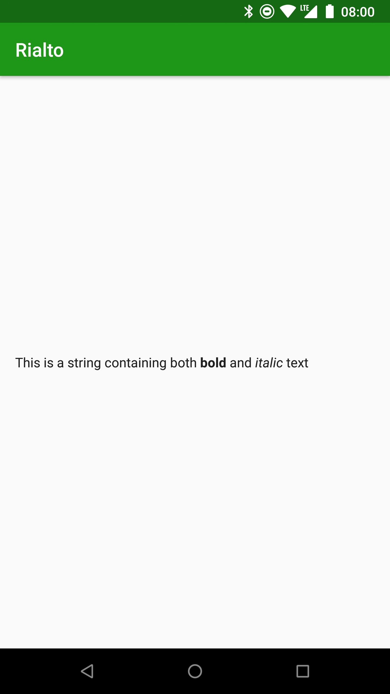
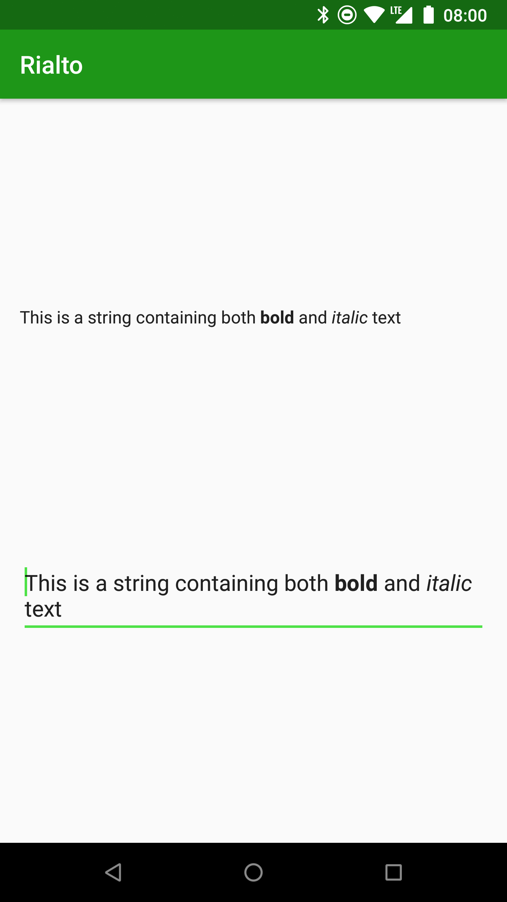
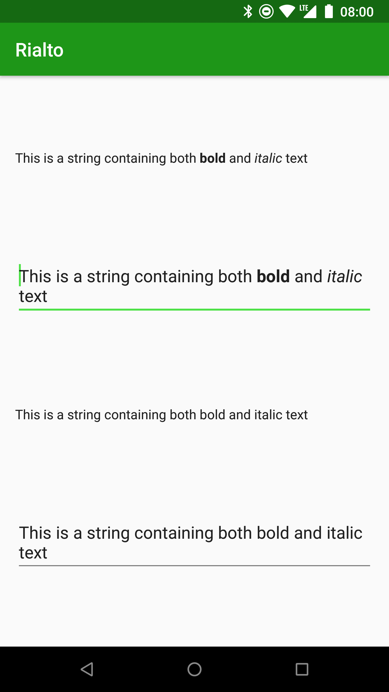
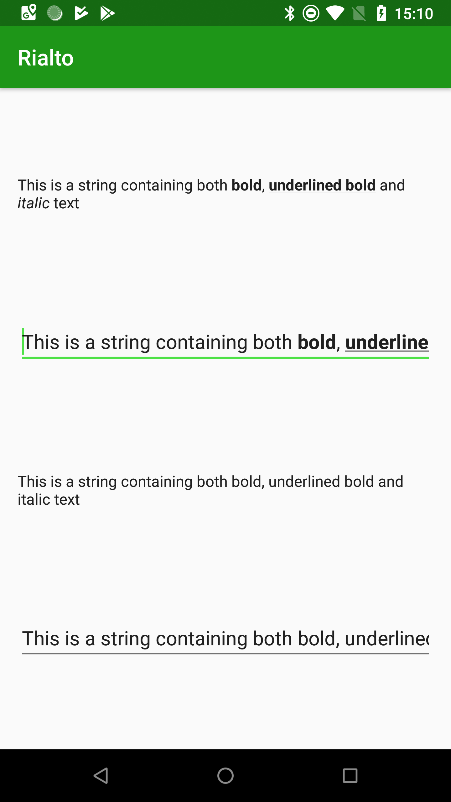

[  ](https://bintray.com/stylingandroid/rialto/library/_latestVersion)

### Rialto

_Rialto_ is an Android text styling library based upon Annotation Spans. Rialto enables you to provide consistent text
formatting throughout your app by using annotations in your string resources.

#### Getting Started

To use Rialto you need to do two things: Firstly you need to initialise the Rialto framework and register  the Spans which will get applied for specific key / value pairs in your annotations; Secondly you need to add annotations to your string resources using those key / value pairs and Rialto will do the rest.

Rialto comes in three flavours depending on whether you're using the legacy Support AppCompat library, AndroidX AppCompat library, or Material components library. It does not currently support apps which use legacy framework themes as it is assumed that most modern apps or using either AppCompat or Material components (which currently depends on AndroidX AppCompat). In this example, we will look at how to use the AndroidX AppCompat version, but there are also examples of using the other flavours in the sample projects within the GitHub repo.

Rialto is published to JCenter, so if you haven't already gort the JCenter repo configured in your build script, then you'll need to add it:

```groovy
buildscript {
    repositories {
        ...
        jcenter()
    }
}
```

The first thing to do is to add the necessary dependency to your project:

```groovy
dependencies {
    ...
    implementation 'com.stylingandroid.rialto:rialto-androidx:1.0.0'
    ...
}
```

If you are using the legacy AppCompat library use the artifact named <code>rialto-support</code> instead; alternatively, if you're using the Material components library use <code>rialto-material</code>.

By far the easiest way to implement Rialto is to use <em>RialtoActivity</em> as the base class for your <em>Activity</em>. Don't worry that you need to extend <em>AppCompatActivity</em> - RialtoActivity is a subclass of that, so you'll automatically get it. The version of <em>AppCompatActivity</em> which will be used will depend upon the flavour of Rialto that you're using. For example rialto-androidx subclasses <em>AppCompatActivity</em> from the Android X version of AppCompat. There is also a way of implementing Rialto without subclassing <em>RialtoActivity</em>, and we'll look at that in a future article.

The next thing that we need to do is register some factories which will be used to create spans whenever annotations are found with specific key /value pairs. It is important to do this before we inflate any layouts because the Rialto framework will perform text formatting during layout inflation, and we therefore need to register these factories first in order to apply the correct formatting. This example shows how we can register a couple of span types to handle bold and italic (yes, I realise that we can already apply these styles using &lt;b&gt; and &lt;i&gt; in our text resources, but the value behind re-implementing these using annotations will become apparent as we explore some slightly more complex examples):

```kotlin
class MainActivity : RialtoActivity() {

    override fun onCreate(savedInstanceState: Bundle?) {
        super.onCreate(savedInstanceState)
        registerSpanFactory("format", "bold") { StyleSpan(Typeface.BOLD) }
        registerSpanFactory("format", "italic") { StyleSpan(Typeface.ITALIC) }
        setContentView(R.layout.activity_main)
    }
}
```

<em>RialtoActivity</em> has a field named factory which is where we perform our registrations, and then we register a couple of span types to specific key value pairs. The lambda is a simple factory method which will create a span of the correct type. This example registers two spans: The first will be applied to any annotation with a key of "format" and a value of "bold" and will apply a bold StyleSpan to the text included within the annotation; the second will will be applied to any annotation with a key of "format" and a value of "italic" and will apply an italic StyleSpan to the text included within the annotation.

Now we create a Layout with a single <em>TextView</em>:

```xml
<?xml version="1.0" encoding="utf-8"?>
<androidx.constraintlayout.widget.ConstraintLayout xmlns:android="http://schemas.android.com/apk/res/android"
  xmlns:app="http://schemas.android.com/apk/res-auto"
  xmlns:tools="http://schemas.android.com/tools"
  android:layout_width="match_parent"
  android:layout_height="match_parent"
  tools:context="com.stylingandroid.rialto.kotlin.MainActivity">

  <TextView
    android:layout_width="0dp"
    android:layout_height="wrap_content"
    android:layout_margin="16dp"
    android:text="@string/main_text"
    app:layout_constraintBottom_toBottomOf="parent"
    app:layout_constraintLeft_toLeftOf="parent"
    app:layout_constraintRight_toRightOf="parent"
    app:layout_constraintTop_toTopOf="parent" />

</androidx.constraintlayout.widget.ConstraintLayout>
```

The string resource with the id <code>@string/main_text</code> that we use for this <em>TextView</em> looks like this:

```xml
<resources>
    ...
    <string name="main_text">This is a string containing both <annotation format="bold">bold</annotation> and <annotation format="italic">italic</annotation> text</string>
    ...
</resources>
```
Note how the attributes of the <code>&lt;annotation ...&gt;</code> elements matches the key / value pairs that we registered earlier.

That's all we need to do, there's no need to manually do any processing, Rialto does it for us:



It also works for EditText:

```xml
<?xml version="1.0" encoding="utf-8"?>
<androidx.constraintlayout.widget.ConstraintLayout xmlns:android="http://schemas.android.com/apk/res/android"
    xmlns:app="http://schemas.android.com/apk/res-auto"
    xmlns:tools="http://schemas.android.com/tools"
    android:layout_width="match_parent"
    android:layout_height="match_parent"
    tools:context="com.stylingandroid.rialto.kotlin.MainActivity">

    <TextView
        android:id="@+id/formatted_text_view"
        android:layout_width="0dp"
        android:layout_height="wrap_content"
        android:layout_margin="16dp"
        android:text="@string/main_text"
        app:layout_constraintBottom_toTopOf="@id/formatted_edit_text"
        app:layout_constraintLeft_toLeftOf="parent"
        app:layout_constraintRight_toRightOf="parent"
        app:layout_constraintTop_toTopOf="parent" />

    <EditText
        android:id="@+id/formatted_edit_text"
        android:layout_width="0dp"
        android:layout_height="wrap_content"
        android:layout_margin="16dp"
        android:text="@string/main_text"
        app:layout_constraintBottom_toBottomOf="parent"
        app:layout_constraintLeft_toLeftOf="parent"
        app:layout_constraintRight_toRightOf="parent"
        app:layout_constraintTop_toBottomOf="@+id/formatted_text_view" />

</androidx.constraintlayout.widget.ConstraintLayout>
```

This produces the following:



Of course, you may not always wish to have formatting applied to all of your TextView and EditText instances within the layout. You can disable formatting by setting the annotationFormatting attribute to false:

```xml
<?xml version="1.0" encoding="utf-8"?>
<androidx.constraintlayout.widget.ConstraintLayout xmlns:android="http://schemas.android.com/apk/res/android"
    xmlns:app="http://schemas.android.com/apk/res-auto"
    xmlns:tools="http://schemas.android.com/tools"
    android:layout_width="match_parent"
    android:layout_height="match_parent"
    tools:context="com.stylingandroid.rialto.kotlin.MainActivity">

    <TextView
        android:id="@+id/formatted_text_view"
        android:layout_width="0dp"
        android:layout_height="wrap_content"
        android:layout_margin="16dp"
        android:text="@string/main_text"
        app:layout_constraintBottom_toTopOf="@id/formatted_edit_text"
        app:layout_constraintLeft_toLeftOf="parent"
        app:layout_constraintRight_toRightOf="parent"
        app:layout_constraintTop_toTopOf="parent" />

    <EditText
        android:id="@+id/formatted_edit_text"
        android:layout_width="0dp"
        android:layout_height="wrap_content"
        android:layout_margin="16dp"
        android:text="@string/main_text"
        app:layout_constraintBottom_toTopOf="@id/unformatted_text_view"
        app:layout_constraintLeft_toLeftOf="parent"
        app:layout_constraintRight_toRightOf="parent"
        app:layout_constraintTop_toBottomOf="@+id/formatted_text_view" />

    <TextView
        android:id="@+id/unformatted_text_view"
        android:layout_width="0dp"
        android:layout_height="wrap_content"
        android:layout_margin="16dp"
        android:text="@string/main_text"
        app:annotationFormatting="false"
        app:layout_constraintBottom_toTopOf="@id/unformatted_edit_text"
        app:layout_constraintLeft_toLeftOf="parent"
        app:layout_constraintRight_toRightOf="parent"
        app:layout_constraintTop_toBottomOf="@id/formatted_edit_text"
        tools:ignore="missingPrefix" />

    <EditText
        android:id="@+id/unformatted_edit_text"
        android:layout_width="0dp"
        android:layout_height="wrap_content"
        android:layout_margin="16dp"
        android:text="@string/main_text"
        app:annotationFormatting="false"
        app:layout_constraintBottom_toBottomOf="parent"
        app:layout_constraintLeft_toLeftOf="parent"
        app:layout_constraintRight_toRightOf="parent"
        app:layout_constraintTop_toBottomOf="@+id/unformatted_text_view"
        tools:ignore="missingPrefix"/>

</androidx.constraintlayout.widget.ConstraintLayout>
```

Using this attribute results in a lint warning, so where we use it we may need to disable the missingPrefix warning using tools:ignore="missingPrefix".

We can see how we can selectively apply the formatting:



#### Combining Spans

One possible complexity when using annotation spans is that it is not possible to use the same key more than once in any specific annotation instance. In other words, if you have <code>&lt;annotation format="bold" format="underline"&gt;...&lt;/annotation&gt;</code> within a string resource you'll get an error because XML does not support multiple attributes of the same name. One solution to this is to nest annotation elements one inside another, but this ends up becoming rather verbose and will bloat your string resources making them difficult to read.

The mechanism that Rialto uses to allow multiple span types to be combined is that it allows you to set multiple span factories for any given key/value pair. The easiest way to demonstrate this is with an example:


```kotlin
class MainActivity : RialtoActivity() {

    override fun onCreate(savedInstanceState: Bundle?) {
        super.onCreate(savedInstanceState)
        registerSpanFactory("format", "bold") { StyleSpan(Typeface.BOLD) }
        registerSpanFactory("format", "italic") { StyleSpan(Typeface.ITALIC) }
        registerSpanFactory("format", "bold_underline") { StyleSpan(Typeface.BOLD) }
        registerSpanFactory("format", "bold_underline") { UnderlineSpan() }
        setContentView(R.layout.activity_main)
    }
}
```

Here we add two separate span factories for the key "<code>format</code>" with the value "<code>bold_underline</code>". When an annotation of <code>&lt;annotation format="bold_underline"&gt;...&lt;/annotation&gt;</code> is encountered within a string resource, then both the bold and underline spans will be applied:



Previously I mentioned that it would become apparent why it is better to apply formatting such as bold and italic using annotations spans rather than &lt;b&gt; and &lt;i&gt; and this is why. While we could achieve bold underline using &lt;b&gt;&lt;u&gt;...&lt;/u&gt;&lt;/b&gt; it would make it much harder to combine these kinds of formats with others which are not supported by the HTML style formatting. However if we use a consistent approach throughout our app, then we can easily combine formats as per this example.


#### Java Interoperability

The other thing worth covering is how to use Rialto in cases where extending <em>RialtoActivity</em> is not possible. Your Activity must implement the RialtoDelegate interface, and needs to construct a RialtoDelegate instance to which it delegates all of the required behaviour:


```kotlin
class MainActivity : AppCompatActivity(), RialtoDelegate {
    private lateinit var delegate: RialtoDelegate

    override fun registerSpanFactory(key: String, value: String, creator: () -&gt; Any) {
        delegate.registerSpanFactory(key, value, creator)
    }

    override fun processAnnotations(text: CharSequence?): CharSequence? =
            delegate.processAnnotations(text)

    override fun onCreate(savedInstanceState: Bundle?) {
        delegate = RialtoDelegateImpl(this)

        super.onCreate(savedInstanceState)
        registerSpanFactory("format", "bold") { StyleSpan(Typeface.BOLD) }
        registerSpanFactory("format", "italic") { StyleSpan(Typeface.ITALIC) }
        setContentView(R.layout.activity_main)
    }
}
```

Implementing RialtoDelegate requires the methods <code>registerSpanFactory(key: String, value: String, creator: () -&gt; Any)</code> and <code>processAnnotations(text: CharSequence?): CharSequence?</code> to be implemented. All we need to do here is create an instance of <code>RialtoDelegateImpl(this)</code> which we do in <code>onCreate()</code> and then we can delegate both of these methods to the <em>RialtoDelegateImpl</em> instance. <strong>It is important to initialise this before the call to <code>super.onCreate()</code> otherwise Rialto will not initialise correctly, and no processing of annotation in string resources will be performed.</strong>

We can also do this from Java in much the same way:


```java
public class MainActivity extends AppCompatActivity implements RialtoDelegate {

    private RialtoDelegate delegate = null;

    @Override
    public void registerSpanFactory(@NotNull String key, @NotNull String value, @NotNull Function0&lt;?&gt; creator) {
        delegate.registerSpanFactory(key, value, creator);
    }

    @Override
    public CharSequence processAnnotations(CharSequence text) {
        return delegate.processAnnotations(text);
    }

    @Override
    protected void onCreate(@Nullable Bundle savedInstanceState) {
        delegate = new RialtoDelegateImpl(this);

        super.onCreate(savedInstanceState);

        registerSpanFactory("format", "bold", new Function0&lt;CharacterStyle&gt;() {
            @Override
            public CharacterStyle invoke() {
                return new StyleSpan(Typeface.BOLD);
            }
        });
        registerSpanFactory("format", "italic", () -&gt; new StyleSpan(Typeface.ITALIC));
        setContentView(R.layout.activity_main);
    }
}
```

The important differences here are with the method signatures of the methods from <em>RialtoDelegate</em> that we need to override. However, if you allow Android Studio to generate the method stubs for you once you have added implements <em>RialtoDelegate</em> to the <em>MainActivity</em> class, then you can't go far wrong.

One last thing worth mentioning is that if you are using Rialto from Java there are a couple of things worth bearing in mind. Firstly, the mechanism for calling <code>registerSpanFactory()</code> will vary depending on whether you are using Java 7 or Java 8:

If you are using Java 7 then you will need to create a Function0 instance as the third argument to <code>registerSpanFactory()</code>:


```java
registerSpanFactory("format", "bold", new Function0&amp;lt;CharacterStyle&amp;gt;() {
    @Override
    public CharacterStyle invoke() {
        return new StyleSpan(Typeface.BOLD);
    }
});
```


However if you are using Java 8 (or Retrolambda) then you can use a lambda instead:

```java
registerSpanFactory("format", "italic", () -&gt; new StyleSpan(Typeface.ITALIC));
```

The second thing that you will need to do is add the Kotlin standard library as a dependency to your project:


```groovy
dependencies {
    ...
    implementation "org.jetbrains.kotlin:kotlin-stdlib-jdk7:$kotlin_version"
    ...
}
```

Rialto is written 100% in Kotlin, but can be used quite easily from Java. The only pre-requisite is that the Kotlin standard library is needed because it contains the Function0 class that is used for Java compatibility of Kotlin lambdas.

#### Internals

One final thing worth noting is that when Rialto does its stuff, it adds spans to the string resource, but does not remove the annotation spans as it goes. The reasoning behind this is that some use-cases may require some further processing of those annotations, and removing them would prevent this. Also, it is worth remembering that on a <em>Spanned</em> instance the individual Span objects are relatively small, so keeping the Annotation instances is going to be a major memory issue.

Rialto is really quite simple to use and the API surface is really quite small. Internally it isn't a particularly large or complex library, it's power is based upon creating the registry of span factories which apply the relevant spans whenever specific annotations are encountered.
